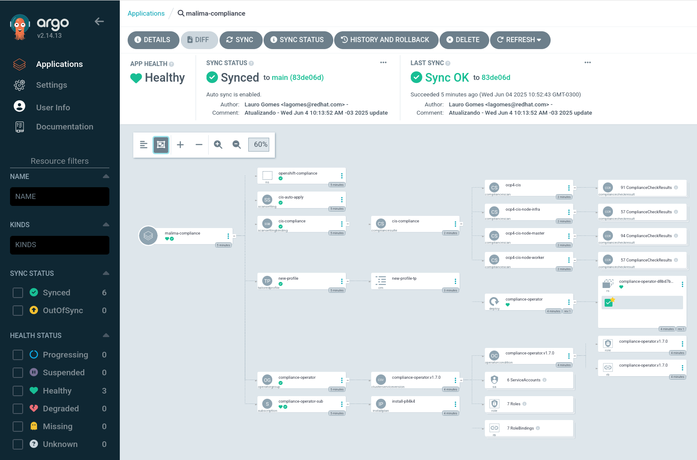
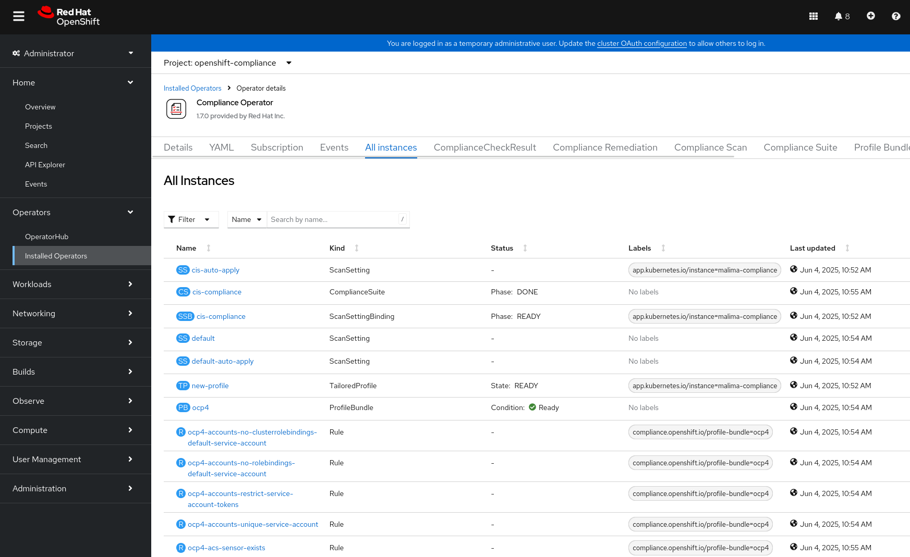

# OpenShift Compliance Operator - GitOps Deployment





## 📜 Visão Geral

Este repositório contém os manifests necessários para a implantação do **Compliance Operator** no OpenShift utilizando o **OpenShift GitOps (ArgoCD)**.

O **Compliance Operator** é uma ferramenta nativa do OpenShift que permite avaliar e validar se o cluster está em conformidade com políticas de segurança baseadas em benchmarks, como o **CIS (Center for Internet Security)**. Ele automatiza o processo de verificação de configurações de segurança, geração de relatórios e ajuda na mitigação de não conformidades.

### 🚀 Por que utilizar o Compliance Operator?

- ✔️ **Automatização de Auditorias de Segurança**
- 🔒 **Validação contínua da conformidade**
- 📄 **Geração de relatórios para processos internos e externos (auditorias)**
- 🔧 **Correções manuais ou automatizadas das não conformidades**
- 🎯 **Aderência a padrões como CIS, NIST e PCI-DSS**

> ✅ A versão utilizada do OpenShift é **4.18** e do **OpenShift GitOps (Argo CD) é 1.16.1**.

---

## ⚙️ Deploy via ApplicationSet

O deploy das políticas do Compliance Operator é realizado utilizando um `ApplicationSet` no OpenShift GitOps. Abaixo um exemplo utilizado neste projeto:

```yaml
apiVersion: argoproj.io/v1alpha1
kind: ApplicationSet
metadata:
  name: compliance
  namespace: openshift-gitops
spec:
  generators:
  - list:
      elements:
      - cluster: malima
        url: https://api.malima.rhbr-lab.com:6443
  template:
    metadata:
      name: '{{cluster}}-compliance'
    spec:
      project: default
      syncPolicy:
        automated:
          prune: true
          selfHeal: true
        syncOptions:
          - CreateNamespace=true
          - SkipDryRunOnMissingResource=true
          - ApplyOutOfSyncOnly=true
          - PruneLast=true
          - Replace=true
      source:
        repoURL: https://github.com/laurobmb/ocp4-compliance-operator
        targetRevision: main
        path: compliance-policys/compliance_yamls
      destination:
        namespace: openshift-compliance
        server: '{{url}}'
````

---

## 🏗️ Como Funciona

1. O Compliance Operator cria **ScanSettingBindings**, que vinculam perfis de segurança (como o CIS) a conjuntos de máquinas.
2. São gerados **ComplianceScans**, que fazem varreduras nos nós do cluster.
3. Os resultados são armazenados como objetos no cluster e podem ser visualizados via Console ou CLI.
4. Se forem encontradas não conformidades, você pode gerar **ComplianceRemediations**, que aplicam correções automaticamente ou manualmente.

---

## 📦 Estrutura do Repositório

```bash
compliance-policys/
└── compliance_yamls/
    ├── ScanSettingBinding.yaml
    ├── ComplianceScan.yaml
    ├── ComplianceRemediation.yaml
    └── ...
```

---

## 🔗 Referências Oficiais

* [Compliance Operator - OpenShift Documentation](https://docs.openshift.com/container-platform/4.18/security/compliance_operator/compliance-operator-understanding.html)
* [OpenShift GitOps Documentation](https://docs.openshift.com/container-platform/4.18/cicd/gitops/understanding-openshift-gitops.html)

---

## 🛠️ Observações

* Este projeto foi testado no OpenShift **4.18** com OpenShift GitOps **1.16.1**.
* As políticas e perfis podem ser customizados conforme a necessidade do seu ambiente.

---